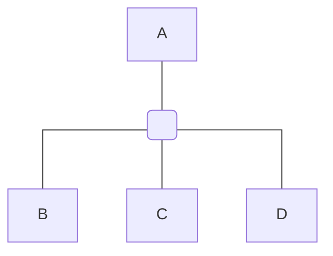

# github-angular-config

[Edit on StackBlitz ⚡️](https://stackblitz.com/edit/github-angular-config)

```mermaid
%%{ init: { 'flowchart': { 'curve': 'stepAfter' } } }%%
flowchart TD
    A["A"] --- T1( )
    T1---B[B] 
    T1---C[C]
    T1---D[D]
```